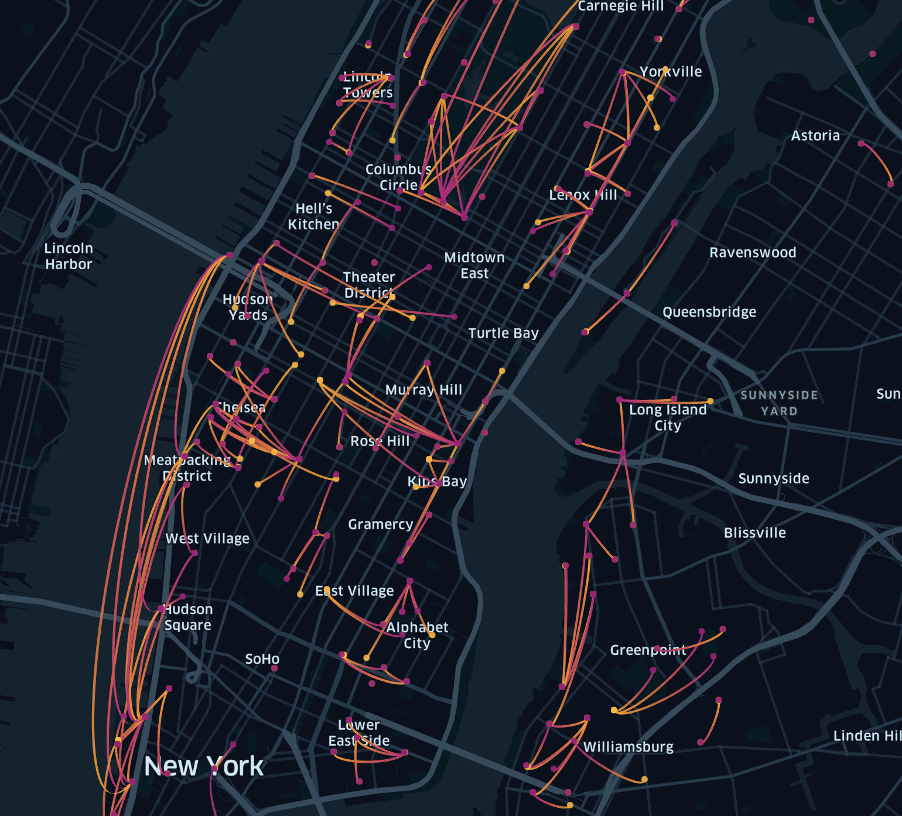
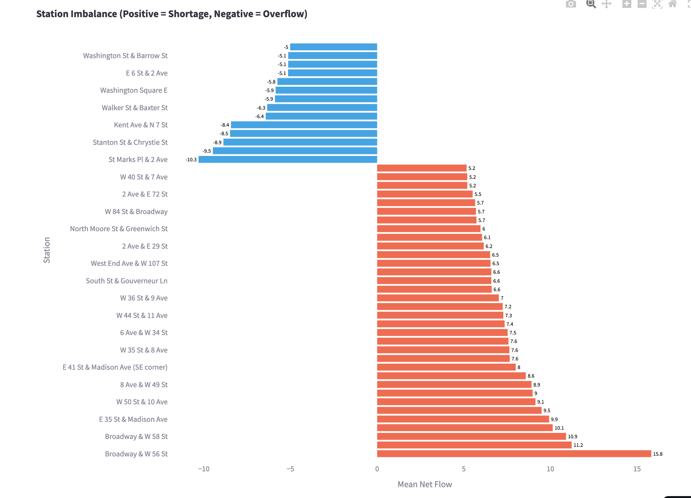
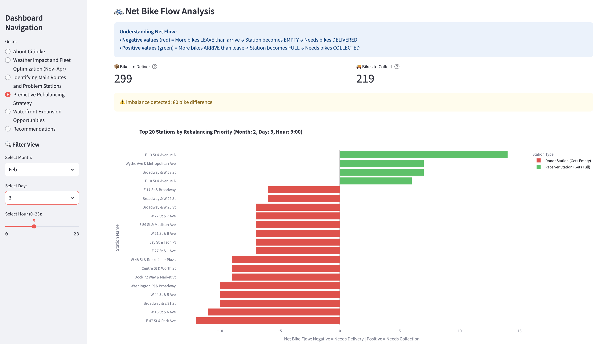
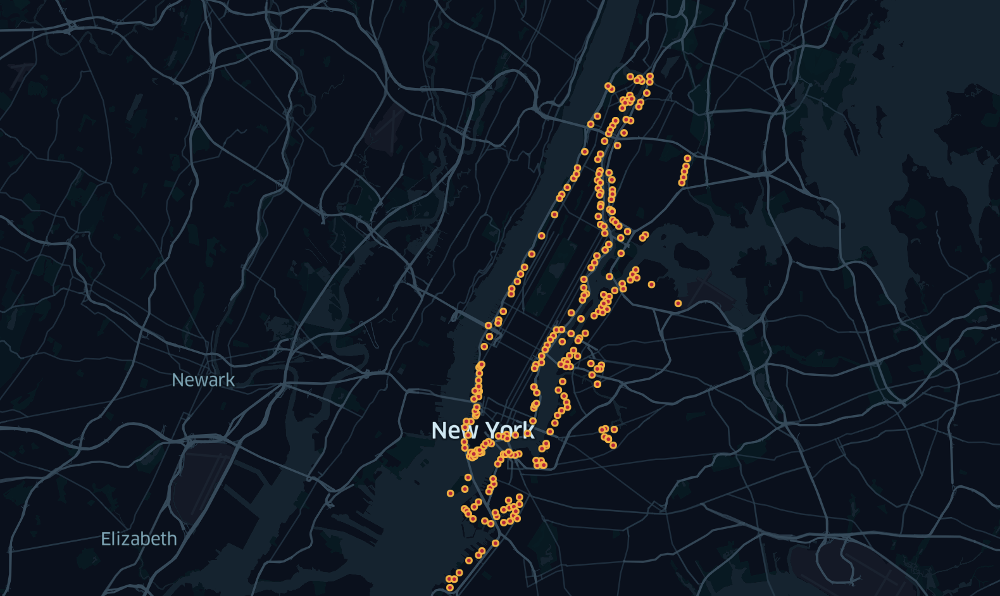
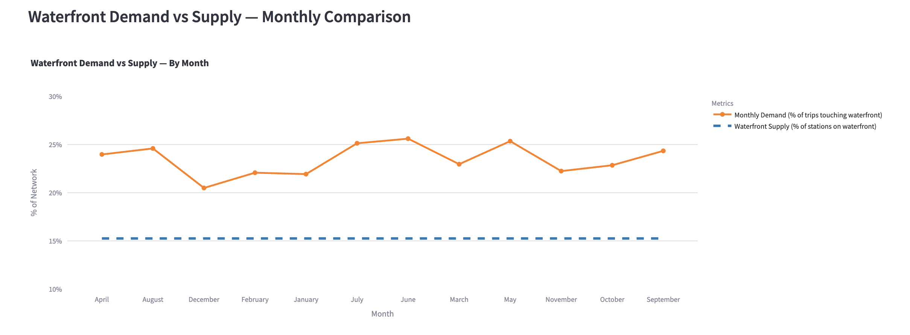
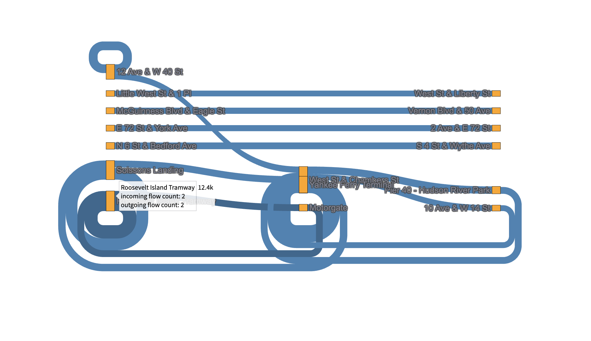
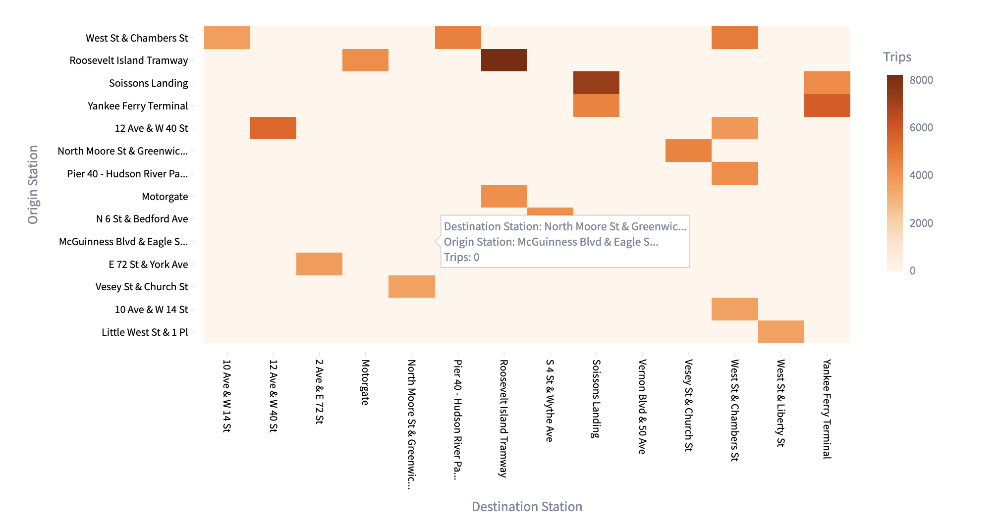

# CitiBike NYC 2022 Ridership Analysis

## Project objective
This analysis examines CitiBike's 2022 ridership to improve bike availability, optimize fleet management, and identify expansion opportunities across New York City.

## Scope
- Weather impact and fleet optimization (Nov–Apr)  
- Identifying main routes and problem stations  
- Predictive rebalancing strategy  
- Waterfront expansion opportunities  
- Actionable recommendations
  
---

### Pareto analysis of CitiBike routes (80/20 rule)
To identify key corridors carrying most system traffic, we applied Pareto analysis to all Origin → Destination (OD) routes.

**Approach:**
- Count total trips for every OD pair  
- Sort routes from highest to lowest volume  
- Calculate each route's % contribution to total traffic  
- Compute cumulative % to find where 80% of trips is reached

**Result:**  
**Only 14% of all routes account for 80% of total CitiBike trips**.

These high-traffic corridors reveal:
- Main commuter pathways  
- Areas with highest operational pressure  
- Priority corridors for rebalancing and infrastructure expansion

---

### Station imbalance analysis (rentals vs returns)
To identify stations that consistently run out of bikes or become overfilled, we calculated net flow for our top 14% most popular stations (which account for ~80% of demand).

**Net Flow = Trips starting at station – Trips ending at station**

- 🔵 **Positive net flow (shortage):** More bikes leave than arrive — station needs delivery  
- 🔴 **Negative net flow (overflow):** More bikes arrive than leave — station needs removal

**Key findings:**
- Midtown stations (Broadway, Madison Ave, West End Ave) show persistent shortages  
- Downtown stations (Old Slip & South St, Washington Square E) accumulate bikes and frequently overflow

**Action:**  
Relocate bikes from overflowing stations to shortage stations to reduce shortages and full-dock issues, improve rider experience, and reduce truck mileage.

---

### Predictive rebalancing strategy
This analysis shows dynamic bike redistribution needs based on actual usage patterns. By analyzing net flow at each station, we predict where bikes need delivery or collection.

We computed the **80th percentile (top 20%) activity threshold** for each month, focusing on operationally critical stations where rebalancing decisions matter most.

**Operational strategy**
- Schedule rebalancing trucks **1 hour before peak times**:  
  - Morning prep (6–7 AM): position bikes at residential/transit hubs before commute  
  - Afternoon prep (4–5 PM): position bikes at business districts before evening rush  
- Use this data to create optimized collection/delivery routes and monitor real-time weather/events

**Cost–benefit**
- Prevents lost revenue from empty stations  
- Prevents operational issues from overflow  
- Improves customer satisfaction

---

### Waterfront expansion opportunities
We explored spatial demand clusters along the Hudson and East Rivers to identify where new stations could relieve congestion and serve riders. This analysis applies a **supply–demand framework** to identify capacity gaps.

**Methodology**
Define Waterfront Zones (example):
- Hunters Point  
- Newtown Creek  
- Harlem River (Core, North, South)  
- Inwood  
- Flushing  
- Gowanus Canal

**Supply–Demand Gap Analysis**
- **Supply:** % of stations within 400m of shoreline in WAP zones  
- **Demand:** % of trips starting/ending in these zones  
- **Gap:** areas where demand exceeds supply

---

### Supply analysis (shoreline-based)
- **Total stations:** 1,757  
- **Waterfront stations (≤ 400m):** 268  
- **Waterfront supply share:** 15.3%

---

### Top waterfront Origin → Destination flows
The Sankey diagram below highlights the top 20 waterfront routes with highest trip counts. Each connection represents major flow between two waterfront stations.

---

### Origin–Destination matrix — top waterfront routes
The matrix below shows trip volumes between the busiest waterfront station pairs. Darker cells indicate stronger flow intensity (higher trip counts).

---
## Recommendations
Waterfront stations make up only **15.3%** of the network, while nearly **24%** of all trips start or end near the riverside. This indicates a **demand–supply gap of ~9 percentage points**.

**Action plan**
1. Add new docking stations along Hudson River and East River  
2. Prioritize high-pressure OD corridors highlighted in the Sankey diagram, e.g.:  
   - Soissons Landing ↔ Vesey St & Church St  
   - Roosevelt Island ↔ Pier 40 (Hudson River Park)  
3. Focus on public access zones: Hunters Point, Newtown Creek, Harlem River areas, Inwood, Flushing, Gowanus Canal  
4. Deploy stations before peak-demand months (May–September)

**Expected impact**
- Reduce bike shortages at popular leisure and commuter waterfront routes  
- Improve accessibility for weekend and tourist riders  
- Balance network capacity between inner-city and riverside zones

## Analysis Method
Programming: Python
Analysis: Data Cleaning, Wrangling, Visualization, Regression Analysis & Modeling
Techniques: Grouping & Aggregating Data, Pareto Analysis, Supply-Demand Gap Analysis
Visualization: Streamlit (Dashboard), Python (Kepler Maps, Matplotlib, Seaborn, Plotly)
Libraries: pandas, NumPy, scikit-learn, statsmodels

## Project Files

For more details, see [Streamlit Dashboard](https://citibike2022.streamlit.app/)
and [GitHub Project Folder](https://github.com/olgagaffarova/New-York-s-CitiBike-trips-in-2022).
