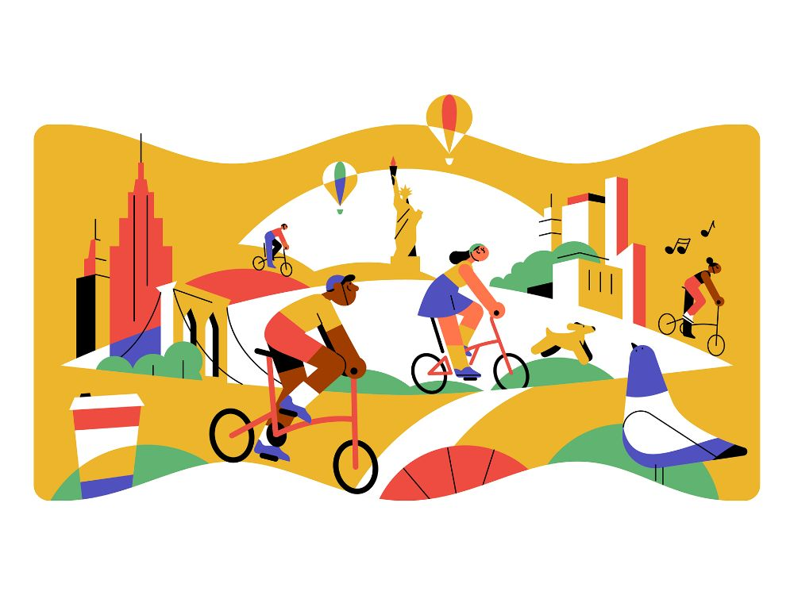

## Portfolio

---

### Category Name 1 

[QS World University Rankings 2026](/sample_page)
**Motivation:**  
It is easy to assume that the best universities are simply those with the highest rankings at the very top of the QS list.  
However, not everyone can realistically enroll in the top 10 due to high competition and cost. This project is motivated by the idea that high-quality education can also be found beyond the top tier when you know what metrics to review.

---
[Citibike Strategy](/sample_page2)
**Motivation:**  
Bike-sharing systems like CitiBike often struggle with uneven bike distribution, leading to empty or full stations. This project was driven by my curiosity to explore how the Pareto ratio—a principle often used to identify the most impactful factors—could be applied to predict and optimize bike redistribution. By analyzing net bike flow and identifying the stations that contribute most to supply-demand imbalances, I aimed to create a predictive rebalancing strategy that improves bike availability while reducing operational inefficiencies.  

---
[Project 3 Title](/sample_page3)

---

### Category Name 2

- [Project 1 Title](http://example.com/)
- [Project 2 Title](http://example.com/)
- [Project 3 Title](http://example.com/)
- [Project 4 Title](http://example.com/)
- [Project 5 Title](http://example.com/)

---

---

Page template forked from <a href="https://github.com/evanca/quick-portfolio">evanca</a>

<!-- Remove above link if you don't want to attibute -->
