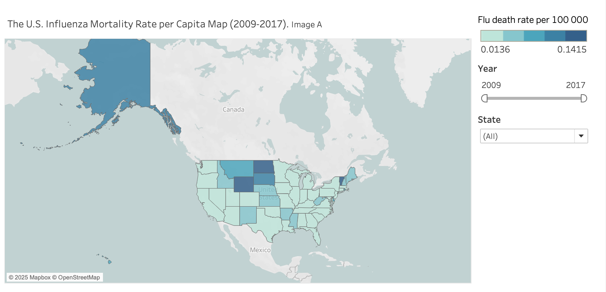
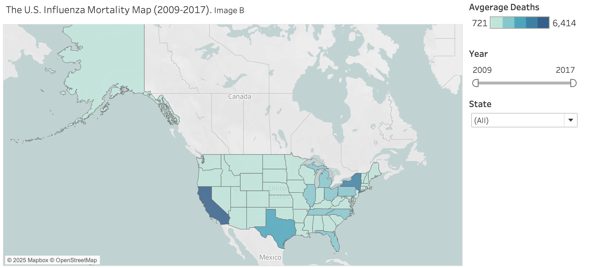
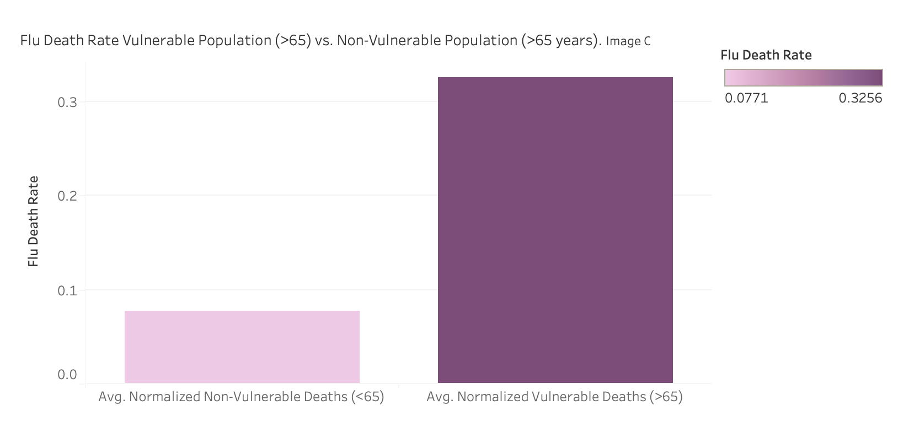
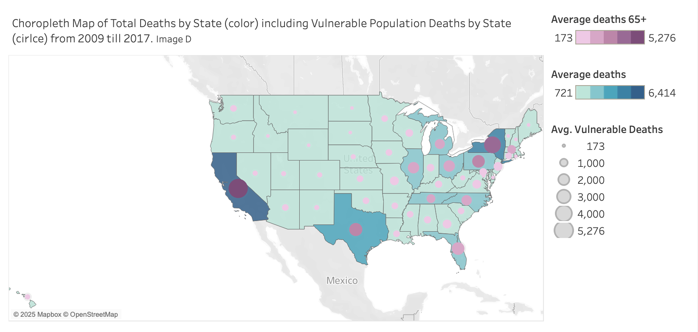
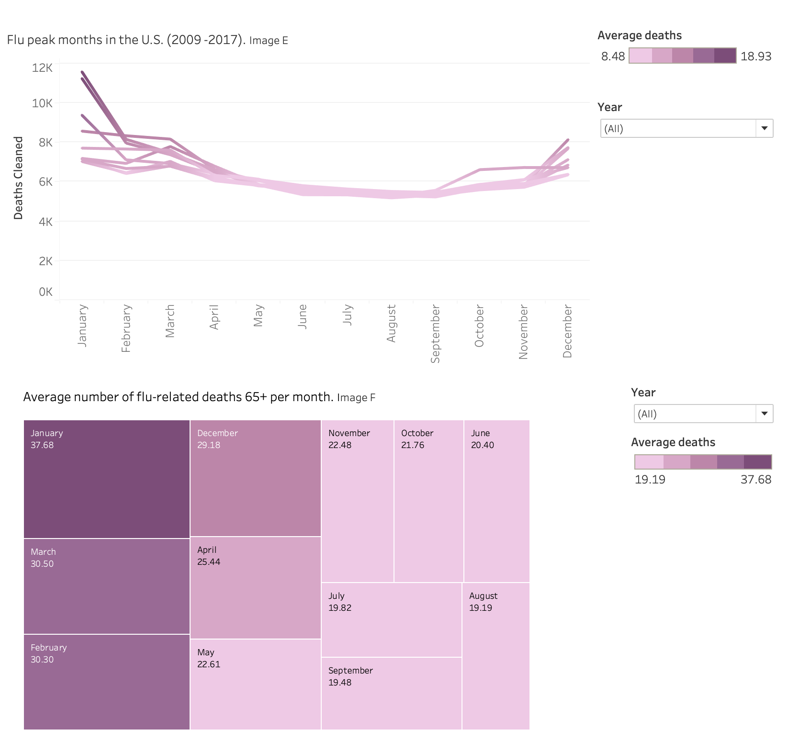
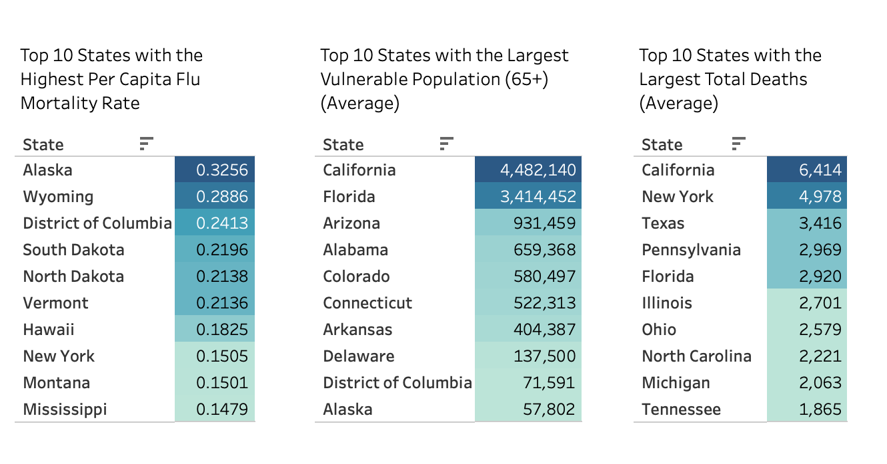
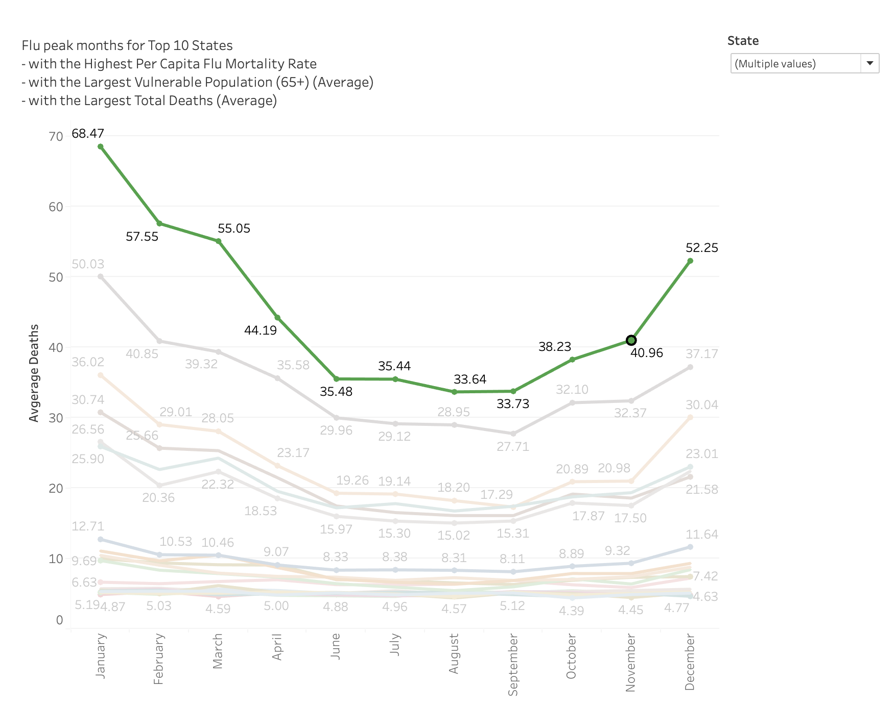

# A Data-Driven Approach to Influenza Planning
## Season 2018-2019 in the United States

## Project Objective
This project aims to help a medical staffing agency that provides temporary workers to clinics and hospitals in each of the 50 states of the United States on an as-needed basis to be prepared for the upcoming influenza season. We will determine when to send staff and to which states in the U.S.

## Scope
- Analyze historical flu mortality data (2009-2017)
- Identify high-risk states and vulnerable populations
- Determine optimal timing for staff deployment
- Develop data-driven staffing allocation strategy
- Provide actionable recommendations for resource planning

## Analysis Method

* **Excel for Data Preparation & Analysis**
  - Cleaned and merged CDC influenza death data with U.S. Census demographics
  - Created derived variables for per capita mortality rates and age group classifications
  - Conducted exploratory data analysis on age groups and mortality patterns
  - Formulated and tested a hypothesis (65+ more likely to die from flu) using a one-tailed t-test
  - Measured correlation between elderly population and flu deaths
  - Categorized states into low, medium, and high need tiers based on vulnerability
  
* **Tableau for Interactive Dashboards**
  - Created spatial visualizations (choropleth maps) to show geographic distribution of flu deaths
  - Developed temporal visualizations to reveal seasonal patterns and peak months
  - Built interactive filters for exploring data by state, age group, and time period
  - Designed stakeholder-ready dashboards for resource allocation decisions

---

## Mortality Rate vs Total Deaths

When deciding where to send medical resources, it is important to consider both the total number of deaths and the death rate per capita to make a well-balanced recommendation.

**Death rate per capita** highlights where the outbreak is most severe relative to the population size, indicating regions that may be overwhelmed despite having smaller populations.

**Total deaths** (or average deaths) show where the largest number of people are affected and where the highest demand for resources and staff is expected.

### Where is the Highest Mortality Rate Per Capita Across the Country?

The choropleth map in Image A illustrates flu death rate per capita by state from 2009 to 2017. Notably, states such as Wyoming, Vermont, North Dakota, and Alaska stand out with the highest per capita flu mortality rates.

### Where is the Highest Number of Deaths Across the Country?

The choropleth map in Image B illustrates average flu deaths by state from 2009 to 2017. Notably, states such as California, Texas, New York, and Pennsylvania stand out with high flu mortality due to their large population sizes.

---

## Who Is at the Highest Risk?

The bar chart reveals a clear trend: adults aged 65 and older face the highest risk of flu-related death. This age group stands out as the most vulnerable population, highlighting the need for targeted attention during flu season.

---

## Where is the Highest Risk?

This choropleth map in Image D illustrates total influenza deaths across U.S. states from 2009 to 2017, with purple circles representing deaths among vulnerable populations aged 65 and older.

States like California, Texas, New York, Pennsylvania, and Florida show the largest purple circles, indicating the highest number of senior deaths. The darker blue shading reflects higher total death counts overall.

---

## Is Influenza a Seasonal Disease?

The line chart in Image E displays the number of flu-related deaths for each month across multiple years (2009–2017). Flu-related deaths consistently peak during the winter months, especially in January and February. After the peak, deaths gradually decrease throughout the year, reaching the lowest points in the summer months. The pattern repeats annually, highlighting seasonality in flu mortality.

The tree map in Image F presents the average number of flu-related deaths per month specifically among the vulnerable population aged 65 and older. The highest average deaths occur in January (37.68), followed by March, February, and December.

Both the line chart and the tree map show that the peak in total deaths and the peak in vulnerable population deaths occur in the same months—primarily in January and February.

### Key Findings:

- States with large senior populations (65+) like Florida and California face compounded risk: large numbers + higher vulnerability. Elderly patients drive higher hospitalization rates and need more intensive medical resources.

- States with high per capita death rates (e.g., Wyoming, Vermont, North Dakota) may be quickly overwhelmed despite small populations.

- Flu season typically begins in fall, with activity starting to increase in October. It usually peaks during the winter months, most commonly between December and February.

---

## Staff Allocation Recommendations

**Prioritization Strategy:**
- **80% of staff resources** to high-need states (focus on ~20% of states (~10 states) that drive ~80% of total flu deaths or face the highest systemic risk)
- **20% of resources** to ensure baseline coverage across all other states

**High-priority states include:**
- States with the highest total flu deaths (California, Florida, New York, Texas, Pennsylvania, Illinois)
- States with large senior populations (double risk: high population + high vulnerability)
- States with highest per capita mortality (Wyoming, Vermont, North Dakota, Alaska) that may have limited healthcare capacity

---

## Staff Allocation Timing Recommendations

Around 80% of flu-related deaths may occur within 20% of the flu season months. If we consider the flu season as five months (November to March), 20% of this period is roughly one month. Since January is the peak month, this suggests that 80% of the burden is likely concentrated around January and early February.

### Suggested Timeline:

- **Start increasing staff allocation in December** to be fully prepared by January
- **Maintain high staffing levels from December through the end of February**
- **In November and March**, a moderate staffing increase is sufficient

### Staff Deployment Timeline Based on Flu Peak Seasonality

Flu outbreaks don't peak at the same time across all U.S. regions:

- **Early deployment (November):** Southeastern states like Florida and Alabama to prepare for early outbreaks
- **Mid-season staffing (Early December):** Ramp up in large states like Texas, California, and New York
- **Late-season surge (January):** Northeastern states like Pennsylvania and Illinois typically peak later

This approach ensures that resources are concentrated where the need is greatest at each stage of the flu season, maximizing efficiency and responsiveness.

---

## Action Plan

1. **Enhance Collaboration with Healthcare Providers**
   - Set up regular coordination meetings with hospitals, clinics, and public health agencies to share data and forecast updates
   - Develop shared staffing models that can be adjusted based on flu severity and outbreak predictions
   - Build real-time data sharing systems through dashboards or APIs to allow near real-time communication of flu trends and resource needs

2. **Integrate Additional Factors**
   - Analyze impact of preventative measures
   - Incorporate behavioral data such as mask-wearing, hand hygiene adherence, and social distancing trends

3. **Expand Data Sources**
   - Integrate electronic health records, pharmacy sales (e.g., flu medications), and absenteeism data from schools and workplaces

4. **Improve Predictive Models**
   - Enhance existing models with machine learning techniques

5. **Public Communication Strategy**
   - Develop accessible and timely reporting mechanisms to keep the public and stakeholders informed
   - Consider creating risk dashboards for different regions or populations

6. **Provide Actionable Recommendations**
   - Vaccination timing guidance
   - Emergency response planning

---

## Project Challenges & Reflections

### Challenge
- **Missing values in CDC data:** Some records had incomplete mortality information
- **Limited data scope:** Dataset tracked only deaths, not hospitalizations or clinic visits
- **Regional variation:** Seasonal spikes varied significantly across states, complicating unified planning

### Solution
- Combined CDC mortality data with U.S. Census demographics to fill gaps and provide population context
- Ran one-tailed t-test to statistically confirm elderly risk hypothesis (65+ age group)
- Grouped states into low, medium, and high need tiers based on multiple vulnerability factors
- Created spatial and temporal visualizations in Tableau to communicate findings to stakeholders

### Reflection
- **Successes:** Clear seasonal patterns (January-February peaks) provided strong foundation for staffing deployment timeline
- **Limitations:** Deaths-only data likely underestimated true healthcare demand since many flu cases require hospitalization without resulting in death
- **Future Improvements:** Incorporate hospitalization data and Influenza-Like Illness (ILI) visit data for more comprehensive resource planning

---

## Project Files

For more details, see the [Tableau Project Storyboard](https://public.tableau.com/app/profile/ola.gaffarova/viz/InfluenzaProjectStoryboardOlaGaffarova/Story1)
