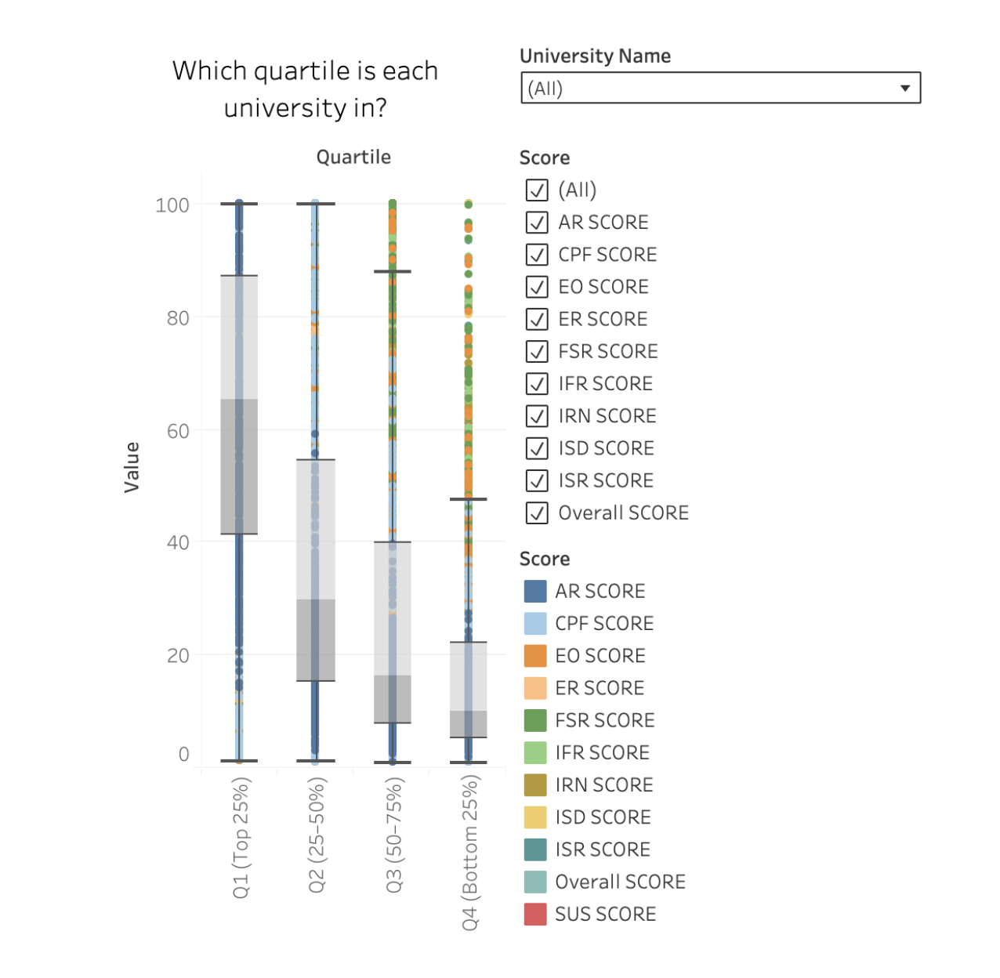
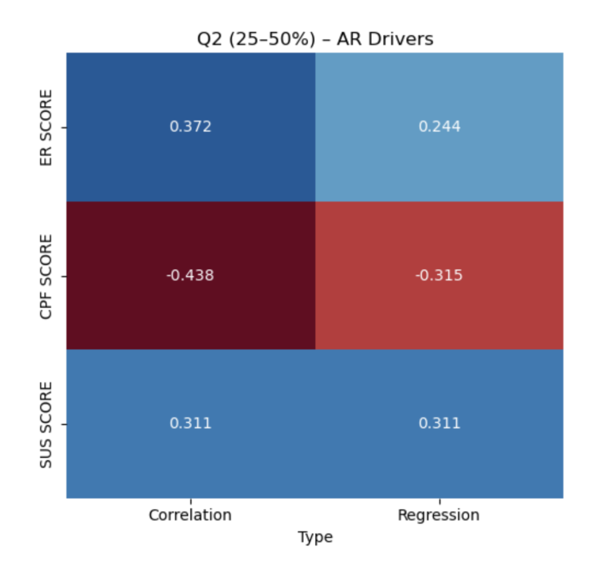
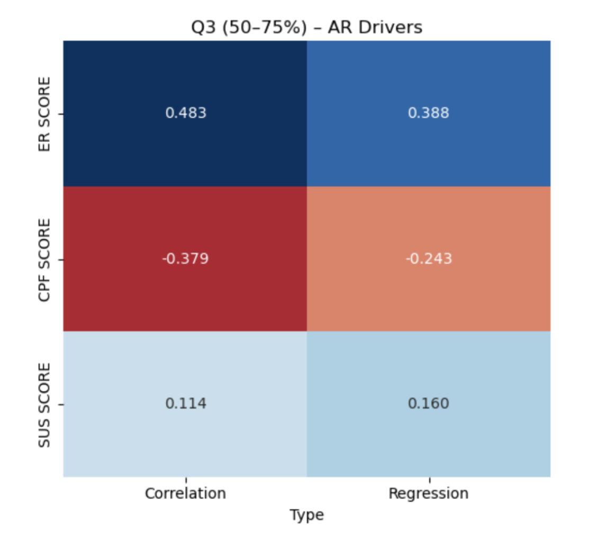

# QS World University Rankings 2026
---

## Objective
According to the QS methodology, the **Discovery and Research lens** carries the greatest weight (50%), with **Academic Reputation (AR)** as its key component (30%).
**The goal of this analysis** is to explore which other scores contribute to success in AR, helping us better understand what drives rankings outside of the top tier.

---

## Scope
- Global distribution of top universities (map) and descriptive statistics
- Differences across quartiles of universities
- Correlation patterns between indicators in each quartile
- Which scores most strongly drive Academic Reputation (AR) in the middle quartiles
- Recommendations for undergraduates based on findings

---

## Analysis Method
- **Python** (pandas, NumPy, matplotlib, seaborn, plotly, scikit-learn, statsmodels) for analysis & visualization
- Data cleaning, merging & creation of derived variables
- Exploratory Data Analysis (EDA) to uncover trends & patterns
- **Tableau** for interactive dashboards
- **Excel** for supplementary analysis

---

## Key Findings
### 1. Understanding University Quartiles

To better understand differences between universities, we split them into four quartiles:
- **Q1 (Top 25%)** – the highest-ranked universities
- **Q2 (25–50%)** – upper-middle universities
- **Q3 (50–75%)** – lower-middle universities
- **Q4 (Bottom 25%)** – the lowest-ranked universities

We created correlation heatmaps to see how different QS scores relate to each other within each quartile.

---

### 2. Key Drivers of Academic Reputation Beyond the Top Tier

The analysis reveals **2 indicators stand out for non-elite universities (Q2–Q3)**:
#### **Employer Reputation (ER)** — 15% weighting
Measures how institutions and their programs are viewed by employers via the Employer Survey.
#### **Sustainability (SUS)** — 5% weighting
New indicator (introduced ~2024) measuring environmental, social, and governance (ESG) factors. Looks at UN SDGs, campus sustainability projects, diversity & governance.
#### **Citations per Faculty (CPF)** — 20% weighting
Captures research output and visibility — average citations per academic staff, normalized by faculty size. Reflects scholarly publications, collaboration, and visibility in academic literature.

---

### 3. Regression Analysis Results

**Multiple Linear Regression** allows us to test all predictors together. It answers: *"When universities have the same SUS, does ER still predict AR?"*

#### What the Regression Shows for Q2–Q3:

- **Employer Reputation (ER)** → remains a strong positive driver of AR, especially in Q3
- **Sustainability (SUS)** → positive influence, strongest in Q2
- **Citations per Faculty (CPF)** → weak or negative, meaning research output alone does not raise AR outside top-tier schools
- **R² ~ 0.30–0.35** → these 3 factors explain about one-third of the variation in AR

---

## Main Insights & Recommendations
### For Universities (Q2–Q3)
**Employer Reputation (ER)**  
Since ER makes up 15% of the weight, focusing on employability gives non-elite schools a potential path to strengthening their reputation.

**Citations per Faculty (CPF)**  
Although CPF carries a 20% weighting, its influence on reputation outside the top tier appears weaker. A strong research profile is valuable, but may not always reflect the undergraduate experience.

**Sustainability (SUS)**  
Despite only 5% weighting, because it is new and less saturated, schools that actively engage in sustainability may benefit more. This indicator signals a university's forward-looking values.

### For Undergraduate Students

When evaluating non-elite universities, consider:
1. **Career outcomes** — How do employers view the university?
2. **Sustainability initiatives** — Does the school align with your values around ESG?

---

## Project Files
For more details see [GitHub Flavored Markdown](https://github.com/olgagaffarova/QS-University-Rankings-2026).
